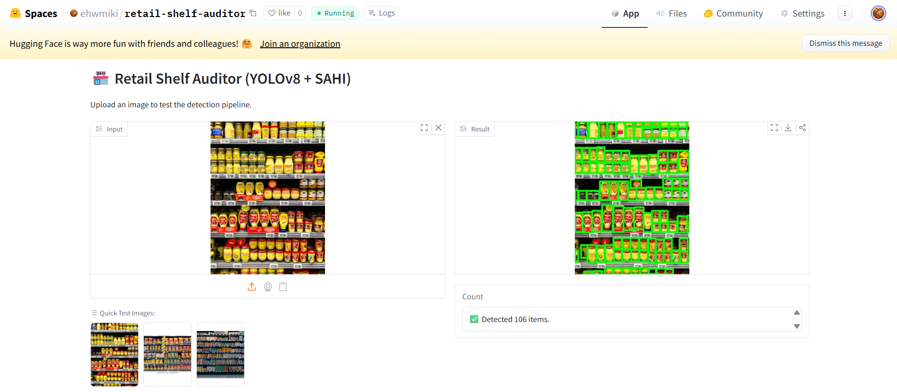

# 🏪 Retail Shelf Auditor (YOLOv8 + SAHI)

[]([YOUR_HUGGING_FACE_LINK_HERE])


### 🎯 The Problem
Retailers lose an estimated **4% of revenue** annually due to "Out of Stock" events and poor planogram compliance. Traditional object detection models (like standard YOLO) fail in this environment because:
1.  **Small Objects:** Products often occupy less than 1% of the image pixels.
2.  **Dense Packing:** Hundreds of items are clustered together, confusing Non-Maximum Suppression (NMS).

### 💡 The Solution
This project implements an end-to-end detection pipeline designed specifically for high-density retail environments.

**Key Techniques:**
* **Transfer Learning:** Fine-tuned `YOLOv8m` on the **SKU-110K** dataset.
* **SAHI (Slicing Aided Hyper Inference):** Instead of resizing the image (which destroys small details), the image is sliced into overlapping 640px tiles. Inference is run on each tile, and results are stitched back together.

### 📸 Demo


### 🛠️ Tech Stack
* **Training:** PyTorch, Ultralytics YOLOv8
* **Inference:** SAHI (Slicing Aided Hyper Inference)
* **Deployment:** Gradio, Hugging Face Spaces
* **Data Processing:** OpenCV, NumPy

### 🚀 How to Run Locally

1. **Clone the repo**
   ```bash
   git clone [https://github.com/](https://github.com/)[YOUR_USERNAME]/Retail-Shelf-Auditor.git
   cd Retail-Shelf-Auditor